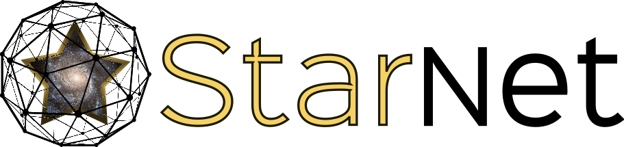

  

# StarNet-AE

## Dependencies

-[PyTorch](http://pytorch.org/): `pip install torch torchvision`

-h5py: `pip install h5py`

## Generative and Interpretable Deep Learning for Stellar Spectra

This project aims to bridge the gap between two different sets of stellar spectra. Although the underlying physics that produces the two sets may be the same, the data can visually appear very different for a variety of reasons. StarNet-AE is meant to utilize the commonalities between two sets of spectra (ie. the physical parameters) while maintaining the freedom to account for additional information found in one of the sets and not the other.
                                   
## Getting Started ##

1. Download the original Payne training set (mock_all_spectra_no_noise_resample_prior_large.npz) from [here](https://www.canfar.net/storage/list/starnet/public/new_lines_project) and place it in the [data directory](./data/).
    
  2. The model architecture and hyper-parameters are set within configuration file in [the config directory](./configs). For instance, I have already created the [base line configuration file](./configs/ae_1.ini). If creating a new model, I suggest copying this one and changing the parameters
  
  5. Using this model as my example, from the main SN_autoenc directory, you can run `python train_synth_ae.py ae_1 -v 1000 -ct 15` which will train your model displaying the progress every 1000 batch iterations and saves the model every 15 minutes. This same command will continue training the network if you already have the model saved in the [model directory](./models) from previous training. (Note that the training takes approximately 3 hours on GPU). Alternatively, if operating on compute-canada see [this script](./scripts/ae_1.sh) for the training. It allows faster data loading throughout training.
  
  6. The [Analysis notebook](./Evaluate_synth.ipynb) takes you through the steps of analyzing the StarNet-Autoencoder to ensure that the model can operate on the synthetic dataset correctly.
  
## Still to come ##

Training on the observed dataset using the synthetic model as the pre-trained weights.
